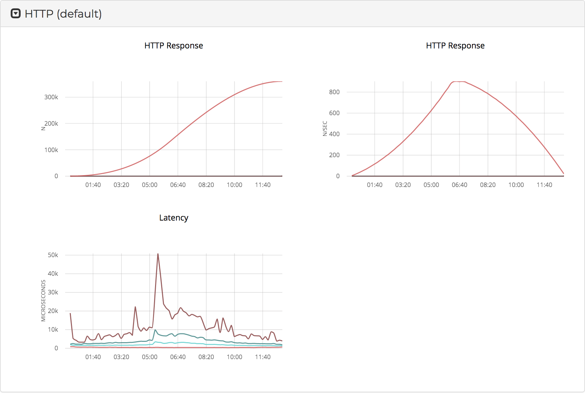
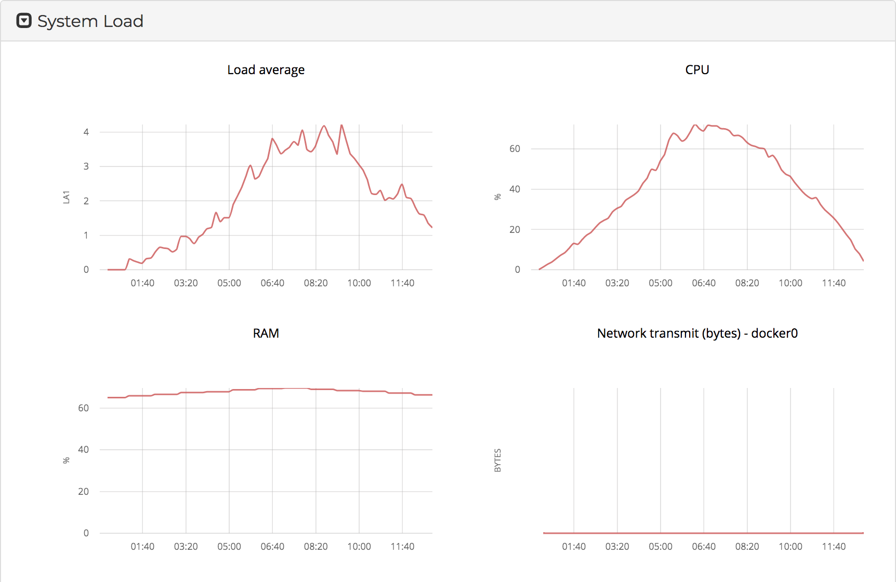
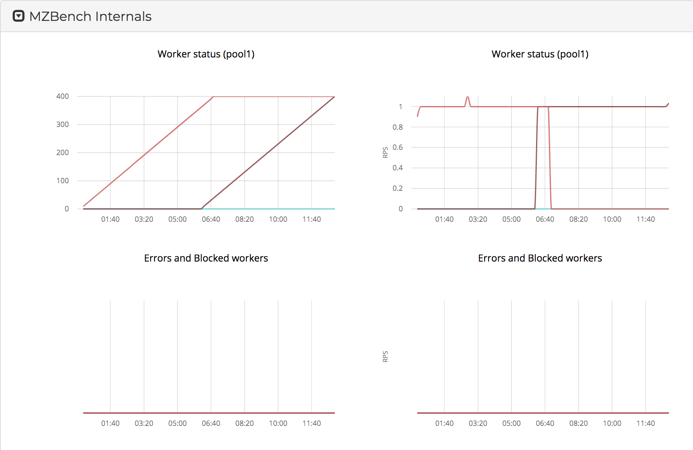
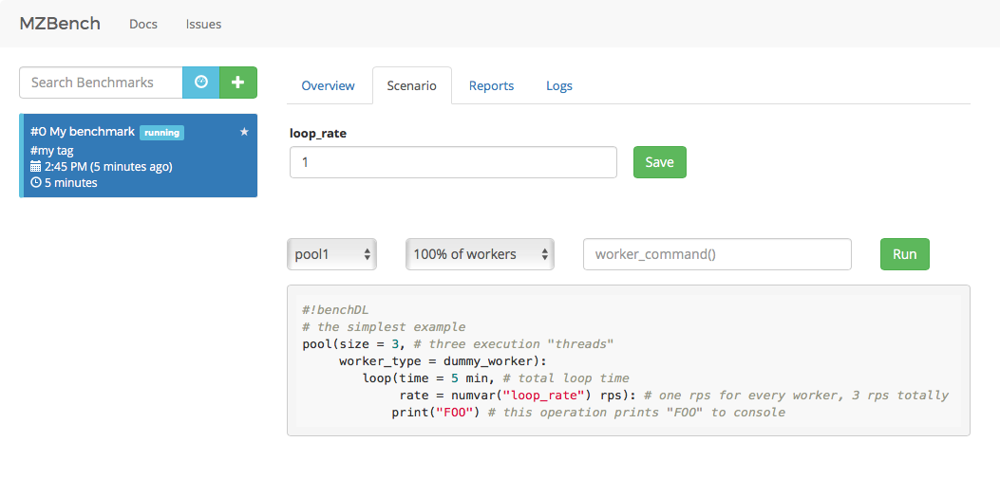
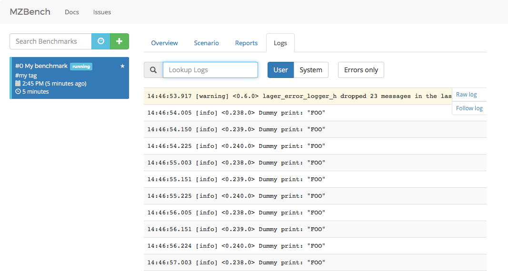
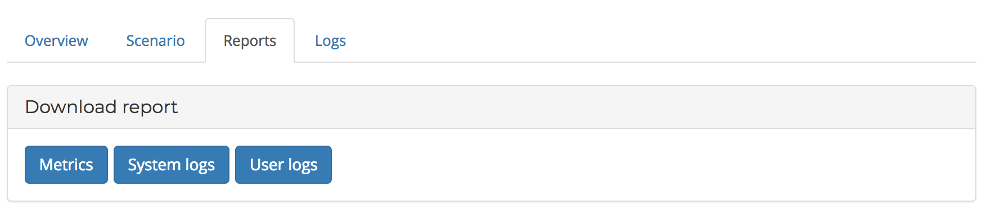
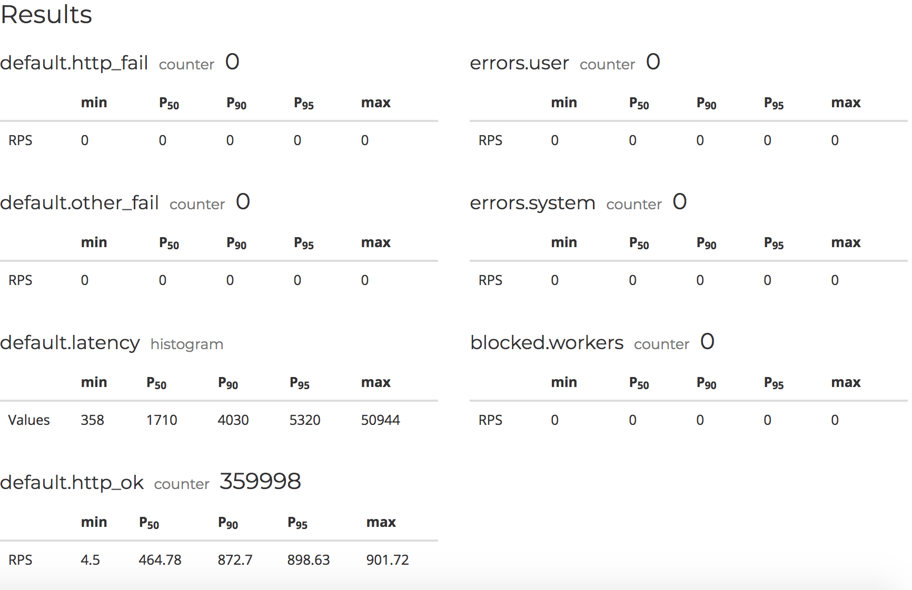
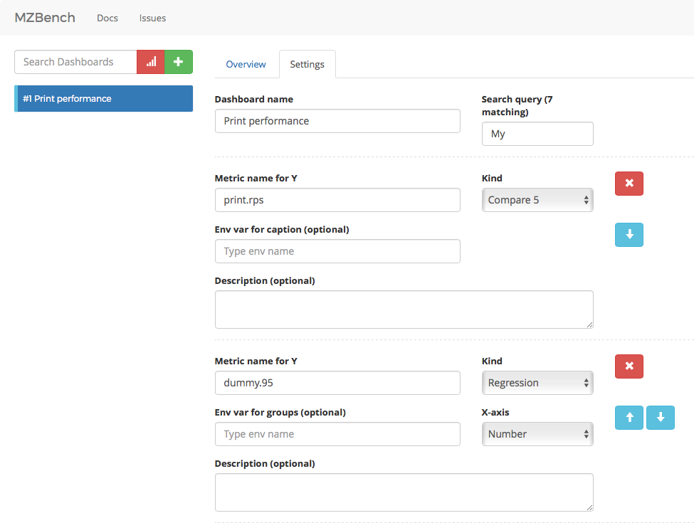
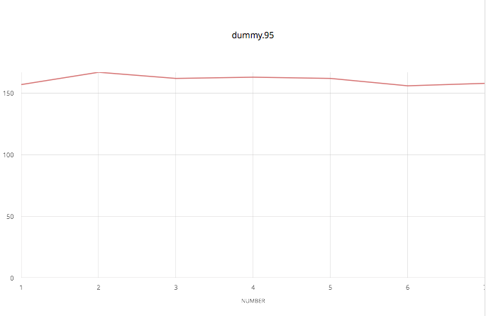
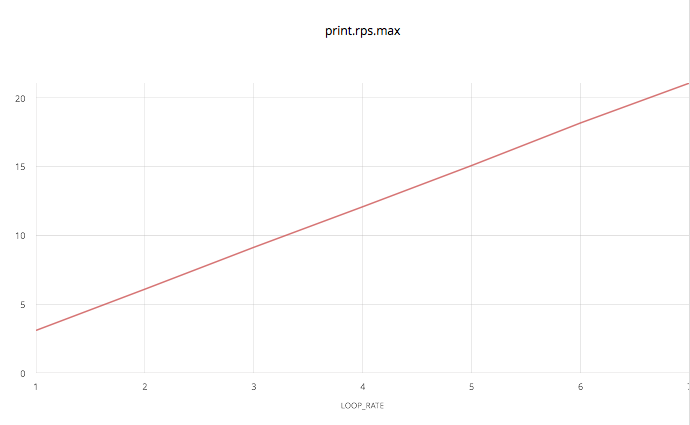

# Starting a benchmark

To start a new benchmark, press green "+" button at the left top, type your
scenario and press green "run" at the right bottom.

# Execution flow

Once benchmark is started it goes through different phases: node allocation,
provisioning, script upload, etc. If exclusive label was specified, it will
wait until no other benchmarks with the same label will be in progress. In this
case, it will be identified as "wait_exclusive".

## Graphs

When "running" phase begins,
you will see charts. There are two built-in groups "System load" and
"MZBench internals", the rest of the charts are worker-specific.

In case of HTTP, charts are showing response kind counters and latencies:

All counters in MZBench are supplied with derivative charts, derivative
shows how quick counter value is changed. In the example above left chart
stands for total number of responses. Red line is `http_ok` code 200.
Right chart is for derivatives.

### System load

MZBench monitors its worker nodes so user can be sure that there is no overload
in benchmarking cluster on a system level.

LA, CPU, RAM and interface-wise traffic metrics are gathered for each node.

### MZBench internals

These metrics are used to diagnose behavior on a level of Erlang application.

Complete list of internals:

* Pool-wise worker status counters: started, ended, failed. You may see linear start scenario in a screenshot above.
* Errors and blocked workers: number of errors during the bench run. Errors divided in two groups: system and user. User errors usually worker-specific.
* Number of log records written and dropped. In case of high load, system might be unable to write every log record, in this case logs are dropped.
* Metric merging time: amount of time taken to merge counters and histograms. Normally it is about few milliseconds, but under high load could be more. If merge time is becoming more than metrics gathering period, system is unhealthy.
* Mailbox messages: node-wise numbers of messages queued for delivery in Erlang VM. This metric is commonly used in monitoring of Erlang systems, if you want to know more about it, please refer to [Erlang documentation](http://erlang.org/doc/getting_started/conc_prog.html#id69544).
* Erlang processes: node-wise number of Erlang processes.
* System metrics report interval: how often metrics are merged, 10 seconds by default.
* Actual time diff with director: for some applications it is important to check time difference in a cluster. This metrics monitors node-wise difference in clocks.
* Time offset at node: this value is evaluated by MZBench and could be subtracted from timestamp to make time difference smaller than it is provided by operation system.
* Director ping time: node-wise metric on how soon a packet is getting to director from worker node.

## Scenario

While benchmark is running it is possible to adjust environmental variables or
execute some code on a given percentage of workers.

## Logs

Logs are available all the time.

## Reports

Metric values could be downloaded for post-processing.

## Finals

After execution is done, MZBench is evaluating final percentiles.
These values could be used to check if the execution was successful, as well as for comparison.

# Comparison

If you need to compare a set of benchmarks you could use "dashboards"
functionality. Dashboard mode switch is close to new benchmark green "+".

You need to set a search criteria for your set of comparable dashboards,
if you don't have it, you could always set some unique tag for this set and
specify this tag as a criteria.

There are three kinds of charts for comparison.

`compare` -- lines from different benchmarks are shown at the same time.

`regression` -- bench number or time is X and metric value is Y.

`xychart` -- env variable is X and metric value is Y.

New data on these dashboards appear as soon as bench finishes.
