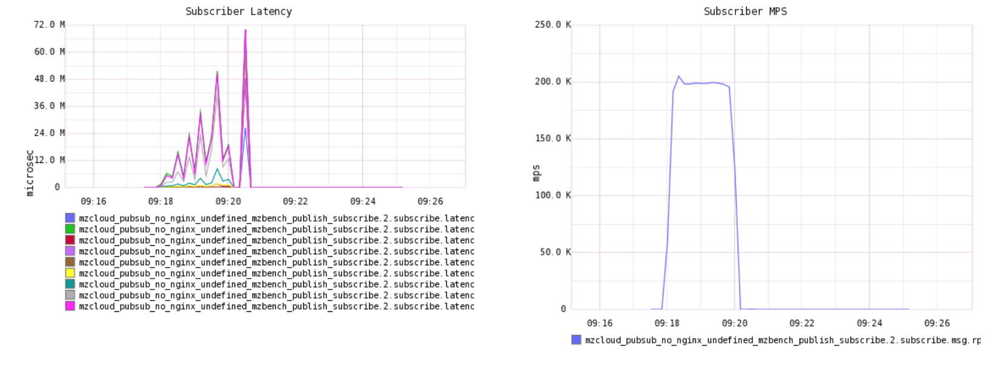

# Welcome to MZBench's Docs!

***Expressive and extendable load testing tool***

---



MZBench is a stress-testing tool for highload projects. It runs your test scenarios on hundreds of thousands of machines and generates real-time graphs.

MZBench ships with a web dashboard that lets you run and review your benchmarks. You can also control MZBench from the command line and via the web API.


## Installation

To use MZBench, you'll need
 - Erlang R17
 - C++ compiler
 - Python 2.6 or 2.7 with pip

Most UNIX systems have C++ compiler and Python preinstalled.

Erlang is available in the [official repositories on most GNU/Linux distros](http://pkgs.org/search/erlang). If your distro doesn't have Erlang R17, [build it from source](http://www.erlang.org/doc/installation_guide/INSTALL.html).  

Download MZBench from GitHub and install Python requirements:

```bash
$ git clone https://github.com/machinezone/mzbench
$ sudo pip install -r mzdench/requirements.txt 
```

## Quickstart

Start the MZBench server on localhost:

```bash
$ cd mzbench
$ ./bin/mzbench start_server
Executing make -C /Users/kmolchanov/Projects/mzbench_official/bin/../server generate
Executing /Users/kmolchanov/Projects/mzbench_official/bin/../server/_build/default/rel/mzbench_api/bin/mzbench_api start
```

The first server start takes a few minutes. The shell will not respond, which is OK; please be patient. Further starts will be much faster.

When the server is runnig, launch an example benchmark:

```bash
$ ./bin/mzbench run examples/ramp.erl
{
    "status": "pending", 
    "id": 0
}
status: running                       00:09
```

Go to [localhost:4800](http://localhost:4800) and see your benchmark live status:


